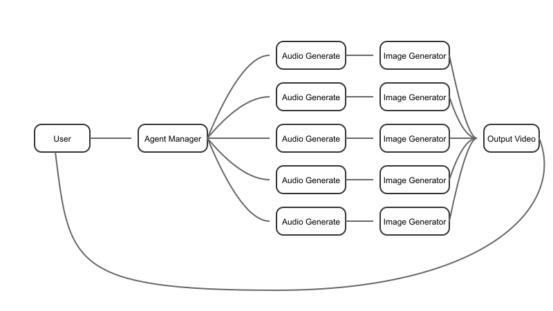

# Multi-Agent Content Generation System: Turning Ideas into Videos

## Introduction

Welcome to the Multi-Agent Content Generation System, an innovative project that leverages GaiaNet's decentralized AI inference network to transform simple prompts into fully realized videos. This system uses a sophisticated network of 12 AI agents to generate content across multiple modalities.

## About GaiaNet

GaiaNet provides decentralized AI inference via public and private hosted nodes. This approach offers several advantages:
- Distributed computing power
- Increased reliability and fault tolerance
- Potential for lower latency depending on node proximity

Our project utilizes GaiaNet's API to access large language models and other AI capabilities in a decentralized manner.


## System Architecture



The system consists of 12 specialized agents:

1. **Script Generator Agent (1)**: Generates the initial script from the user's prompt using GaiaNet's API.
2-6. **Audio Agents (5)**: Each responsible for generating audio for one scene of the video.
7-11. **Image Agents (5)**: Each responsible for generating an image for one scene of the video.
12. **Agent Manager**: Coordinates the other agents and compiles the final video.

## How It Works

The system operates in three main stages:

1. **Script Generation**: The Script Generator Agent creates a script based on the user's prompt.
2. **Content Creation**: Audio and Image Agents generate content for each scene of the script.
3. **Video Compilation**: The Agent Manager combines all the generated content into a cohesive video.

When a user submits a prompt:
1. The prompt is sent to the Script Generator Agent, which creates a script using GaiaNet's API.
2. The script is divided into scenes, each processed by an Audio Agent and an Image Agent.
3. The Agent Manager coordinates the process and compiles the generated audio and images into a final video.

## Project Structure

```
.
├── LICENSE
├── README.md
├── backend
│   ├── codebase.sh
│   ├── package.json
│   └── src
│       ├── agentManager.js
│       ├── audioAgent.js
│       ├── imageAgent.js
│       ├── index.js
│       ├── scriptAgent.js
│       └── videoCompiler.js
├── components.json
├── index.html
├── package.json
├── postcss.config.js
├── public
│   └── vite.svg
├── src
│   ├── App.tsx
│   ├── components
│   │   ├── ui
│   │   │   ├── alert.tsx
│   │   │   ├── badge.tsx
│   │   │   ├── button.tsx
│   │   │   ├── input.tsx
│   │   │   └── label.tsx
│   │   └── video-generator-vercel.tsx
│   ├── lib
│   │   └── utils.ts
│   ├── main.tsx
│   ├── styles
│   │   └── globals.css
│   └── vite-env.d.ts
├── tailwind.config.js
├── tsconfig.json
├── tsconfig.node.json
└── vite.config.ts
```

## Key Components

### Backend

- `backend/src/index.js`: The main entry point and Express server setup.
- `backend/src/scriptAgent.js`: Generates the initial script from the user's prompt.
- `backend/src/audioAgent.js`: Handles audio content creation.
- `backend/src/imageAgent.js`: Manages image generation.
- `backend/src/videoCompiler.js`: ffmpeg based compiler helper for the final video.
- `backend/src/agentManager.js`: Coordinates the agents and compiles the final video.

### Frontend

The frontend is built with React, Vite, and Tailwind CSS. Key components include:

- `src/App.tsx`: The main React component that sets up routing.
- `src/components/video-generator-vercel.tsx`: The main component for the video generation interface.
- `src/components/ui/`: Contains reusable UI components like buttons, inputs, and alerts.

## Installation

### Backend

1. Navigate to the `backend` directory:
   ```
   cd backend
   ```

2. Install dependencies:
   ```
   npm install
   ```

3. Create a `.env` file in the `backend` directory and add your API keys:
   ```
   OPENAI_API_KEY=your_openai_api_key_here
   SEGMIND_API_KEY0=your_segmind_api_key_here
   ```

### Frontend

1. From the project root, install dependencies:
   ```
   npm install
   ```

## Running the Project

### Backend

1. Navigate to the `backend` directory:
   ```
   cd backend
   ```

2. Start the server:
   ```
   npm run dev
   ```

The server will start on the port specified in your environment (default is 4000).

### Frontend

1. From the project root, start the development server:
   ```
   npm run dev
   ```

The frontend will be available at `http://localhost:3000`.

## API Endpoints

- `POST /api/generate`: Start video generation with a prompt
- `GET /api/status/`: Get the status of generation agents
- `GET /api/video`: Retrieve the generated video 

## Usage

1. Open the frontend in your web browser (default: `http://localhost:3000`).
2. Enter a prompt in the input field.
3. Click "Generate Video" to start the video generation process.
4. Wait for the video to be generated. You can monitor the progress on the frontend.
5. Once the video is ready, click "Download Video" to save it to your device.

## Important Notes

- Video generation can take several minutes.
- Do not refresh or leave the page during the generation process.
- If the generate button doesn't respond, you may be in a queue. Wait for 1-2 minutes and try again.

## Future Developments

- Implementing user feedback loops for content refinement
- Exploring real-time video generation capabilities
- Expanding the use of GaiaNet's decentralized AI capabilities

## Contributing

Contributions are welcome! Please feel free to submit a Pull Request.

## License

This project is licensed under the MIT License. See the LICENSE file for details.